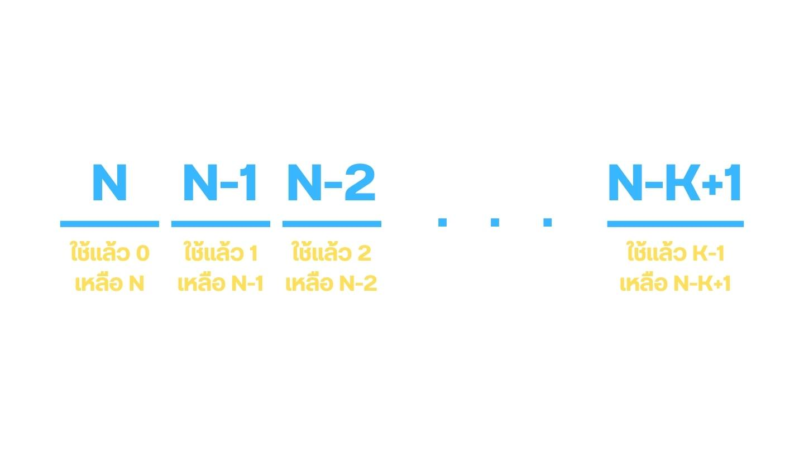
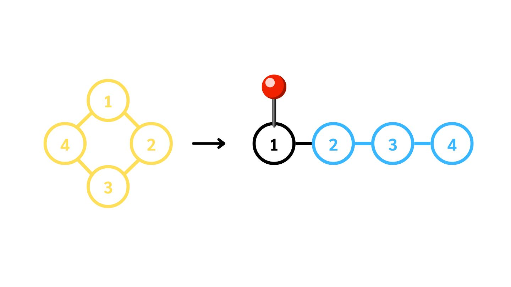

# การนับและความน่าจะเป็น (Combinatorics and Probability)
### สิ่งที่ควรเรียนมาก่อน (Prerequisite)
- [ตรรกศาสตร์ (Logic)](Logic.md)  
- [เซต (Set)](Set.md)
- [จำนวนจริง (Real Number)](RealNumber.md)

ในเรื่องนี้เราจะได้เรียนโจทย์เกี่ยวกับการนับจำนวนวิธี เช่น 

วิธีการเลือกจำนวนเต็มบวก 3 ตัวโดยที่ผลรวมของทั้ง 3 ตัวมีค่าไม่เกิน 10
## กฎการนับพื้นฐาน

### 1. ห้ามนับขาด
### 2. ห้ามนับเกิน

หากเราสามารถทำตามกฎสองข้อนี้ได้เราก็จะสามารถนับวิธีได้แล้ว เย้ๆ

## กฎการคูณ

หากเราจะนับเหตุการณ์หลายๆ เหตุการณ์ที่ไม่เกี่ยวข้องกัน (Independence) แต่สามารถเกิดขึ้นพร้อมกันได้

เราสามารถนำจำนวนวิธีในแต่ละเหตุการณ์มาคูณกันได้เลย เช่น

เรามีเสื้อ $3$ ตัว กางเกง $4$ ตัว เราสามารถแต่งตัวได้กี่แบบโดยที่ต้องใส่เสื้อและกางเกงอย่างละ $1$ ตัว

ในเหตุการณ์นี้ไม่ว่าเราจะเลือกใส่เสื้อตัวไหนก็ไม่เกี่ยวกันกับว่าเราจะใส่กางเกงตัวไหน 

เราเลยสามารถนำจำนวนวิธีมาคูณกันได้เลย คือ $3 \times 4 = 12$ แบบ

## กฎการบวก

หากเราจะนับเหตุการณ์หลายๆ กลุ่ม ซึ่งเกิดขึ้นพร้อมกันไม่ได้เราสามารถนำจำนวนวิธีมาบวกกันได้เลย เช่น

เรามีเสื้อโปโล $2$ ตัว เสื้อสูท $1$ ตัว เสื้อยืด $3$ ตัว เราอยากใส่เสื้อ $1$ ตัวเราสามารถใส่ได้กี่แบบ

ในเหตุการณ์นี้เราสังเกตว่าเสื้อจะใส่พร้อมกันไม่ได้ เราเลยสามารถนำจำนวนวิธีมาบวกกันได้เลย

นั้นคือ $2 + 1 + 3 = 6$ แบบ

## ตัวอย่างโจทย์ 

### สอวน. คอมปี 62 ข้อที่ 47 

จำนวนเต็มบวกสามหลักที่เป็นจำนวนคู่ มีกี่จำนวน

- จำนวนจะเป็นจำนวนคู่ก็ต่อเมื่อมีเลขหลักสุดท้ายเป็นจำนวนคู่ ซึ่งมีทั้งหมด $5$ จำนวนได้แก่ $0, 2, 4, 6, 8$

- เลขสามหลักจะต้องไม่นำหน้าด้วยเลข $0$

- เราสามารถใช้กฎการคูณได้ดังนี้
    - หลักแรกเป็นอะไรก็ได้ที่ไม่ใช่ $0$ มีทั้งหมด $9$ จำนวน
    - หลักที่สองเป็นอะไรก็ได้ มีทั้งหมด $10$ จำนวน
    - หลักที่สามเป็นเลขคู่อะไรก็ได้ มีทั้งหมด $5$ จำนวน

- จึงต้องตอบว่ามีทั้งหมด $9\cdot 10\cdot 5 = 450$ จำนวน

## แฟกทอเรียล (Factorial)

เป็นการดำเนินการที่จำเป็นต้องใช้ในการนับ โดยเครื่องหมายคือ $!$ นิยามว่า 

- $n! = n \cdot (n-1) \cdot (n-2) \cdot ... \cdot 3 \cdot 2 \cdot 1$ สำหรับ $n \in \mathbb{N}$
- $0! = 1$

หรือก็คือผลคูณของเลขทุกตัวตั้งแต่ $1$ จนถึง $n$ นั่นเอง เช่น

- $3! = 3\cdot 2\cdot 1 = 6$
- $5! = 5\cdot 4\cdot 3\cdot 2\cdot 1 = 120$

## การเรียงสับเปลี่ยน (Permutation)

เราสามารถนำของทั้งหมด $N$ ชิ้น จากนั้นเลือกมาเรียงเป็นลำดับทั้งหมด $K$ ชิ้น

จะสามารถทำได้ทั้งหมด $N \cdot (N - 1) \cdot (N - 2) \cdot ... \cdot (N - K + 1)$ แบบ

ซึ่งมีค่าเท่ากับ $\frac{N!}{(N-K)!}$ แบบ ซึ่งจะเขียนแทนด้วย $P_{N,K}$

วิธีการนับคือ เราจะค่อย ๆ นำของมาวางเรื่อย ๆ โดย

- ชิ้นที่ $1$ เราสามารถเลือกของมาวางได้ทั้งหมด $N$ ชิ้น
- ชิ้นที่ $2$ เราสามารถเลือกของมาวางได้ทั้งหมด $N-1$ ชิ้น
- ชิ้นที่ $3$ เราสามารถเลือกของมาวางได้ทั้งหมด $N-2$ ชิ้น
- ...
- ชิ้นที่ $K$ เราสามารถเลือกของมาวางได้ทั้งหมด $N-K+1$ ชิ้น

### ตัวอย่าง

มีนักเรียน $24$ คนยืนเรียงแถวต่อเป็นเส้นตรง อย่างทราบว่ามีรูปแบบการเรียงแถวได้กี่แบบ

- จะต้องตอบว่ามีทั้งหมด $\frac{24!}{(24 - 24)!} = 24!$ แบบ

มีนักเรียน $24$ คนยืนเรียงแถวต่อเป็นเส้นตรง เอานักเรียนออกจากแถวไป $6$ คน รูปแบบการเรียงแถวของนักเรียนที่เหลืออยู่มีทั้งหมดกี่แบบ

- เหมือนเราเลือกนักเรียน $24 - 6 = 18$ คน มายืนในแถว
- จะต้องตอบว่ามีทั้งหมด $\frac{24!}{(24 - 18)!} = \frac{24!}{6!}$ แบบ

(สอวน. คอมปี 66 ข้อที่ 82) จงหาจำนวนที่เป็นไปได้ทั้งหมดของเลขคู่ $6$ หลักที่ถูกสร้างจากเลข $0, 3, 4, 5, 7, 9$ โดยใช้ตัวเลขไม่ซ้ำกัน

- สังเกตว่ามีเลขโดดคู่เพียงสองจำนวน คือ $0, 4$

- เลขหกหลักจะขึ้นด้วยเลข $0$ ไม่ได้

- เราสามารถแบ่งเป็น $2$ กรณี ที่ไม่เกี่ยวข้องกันคือ
    - เลขหลักสุดท้ายคือ $0$ หลักที่เหลือจะใส่อย่างไรก็ได้เนื่องจากเลข $0$ ใช้ไปแล้ว จึงมีทั้งหมด $5 \cdot 4\cdot 3\cdot 2\cdot 1 = 120$ แบบ
    - เลขหลักสุดท้ายเป็น $4$ เลขหลักแรกจะใส่อะไรก็ได้ที่ไม่ใช่ $0$ ซึ่งมีทั้งหมด $4$ ตัว หลังจากนั้นเลขที่เหลืออยู่จะใส่อย่างไรก็ได้ จึงมีทั้งหมด $4 \cdot 4\cdot 3\cdot 2\cdot 1 = 96$ แบบ
- จากนั้นใช้กฎการบวกจะมีทั้งหมด $120 + 96 = 216$ จำนวนนั่นเอง

## การเรียงสับเปลี่ยนแบบมีของซ้ำได้

ในการเรียงสับเปลี่ยนของ $N$ ชิ้นโดยมีของทั้งหมด $K$ กลุ่มที่มีหน้าตาเหมือนกันจะเรียงสับเปลี่ยนได้ทั้งหมด

- $\frac{N!}{n_{1}!n_{2}!n_{3}!...n_{K}!}$

เมื่อ $n_{i}$ คือจำนวนของในกลุ่มที่ $i$ เช่น

จงหาจำนวนคำที่เกิดจากการเรียงสับเปลี่ยนคำว่า "coffee" 

- สังเกตว่ามีของทั้งหมด $4$ กลุ่มได้แก่ 
    - c : $1$ ตัว
    - o : $1$ ตัว
    - f : $2$ ตัว
    - e : $2$ ตัว

เมื่อเรานำมาเข้าสูตรจะได้คำทั้งหมด $\frac{6!}{1!1!2!2!} = \frac{720}{4} = 180$ คำ

## การเรียงสับเปลี่ยนแบบวงกลม

การเรียงของ $N$ ชิ้นเป็นวงกลมจะสามารถเรียงได้ทั้งหมด $(N-1)!$ แบบ โดยให้คิดเหมือนเรา บังคับตำแหน่งของชิ้นนึง และทำการเรียงสับเปลี่ยนของชิ้นที่เหลือเป็นเส้นตรงต่อ

## การจัดหมู่ 

เราสามารถคำนวณวิธีการเลือกของ $K$ ชิ้นจากทั้งหมด $N$ ชิ้นโดยไม่สนใจลำดับการเลือก ได้โดยจะมีทั้งหมด $\frac{P_{N, K}}{K!}$ แบบ 

นั่นคือการหยิบของมา $K$ ชิ้นแล้วสังเกตว่าของทั้ง $K$ ชิ้นที่หยิบมาสามารถเรียงลำดับได้ทั้งหมด $K!$ แบบ จึงนำ $K!$ ไปหารเพราะเราไม่ลนใจลำดับการหยิบ

- $\frac{P_{N, K}}{K!} = \frac{N!}{(N-K)!K!}$

โดยเราจะเขียนแทนจำนวนวิธีด้วย $\binom{N}{K}$ อ่านว่า "$N$ เลือก $K$"

### ตัวอย่างโจทย์

มีข้อสอบทั้งหมด 10 ข้อ แต่ละข้อมี 2 ตัวเลือก และมีตัวเลือกที่ถูกต้องเพียงตัวเลือกเดียว อยากรู้ว่าจะสามารถทำข้อสอบได้กี่แบบ ที่ทำให้ตอบถูกทั้งหมด 6 ข้อ

- เลือกข้อที่จะผิดได้ทั้งหมด $\binom{10}{4} = 210$ แบบ

## ทฤษฎีบททวินาม

$(x+y)^{n} = \binom{n}{0}x^{0}y^{n} + \binom{n}{1}x^{1}y^{n-1} + \binom{n}{2}x^{2}y^{n-2} + ... + \binom{n}{n-1}x^{n-1}y^{1} + \binom{n}{n}x^{n}y^{0}$

# ความน่าจะเป็น

ให้ $E$ เป็นเซตของเหตุการณ์ที่เราสนใจ 

และ $S$ เป็นเซตของเหตุการณ์ทั้งหมด (Sample Space)

ความน่าจะเป็น $P(E)$ จะเท่ากับ $\frac{n(E)}{n(S)}$