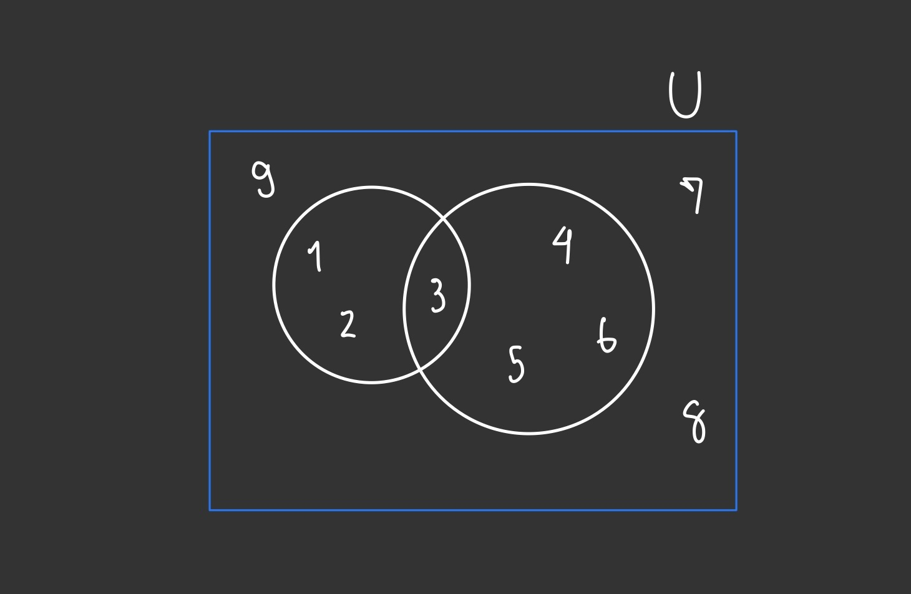
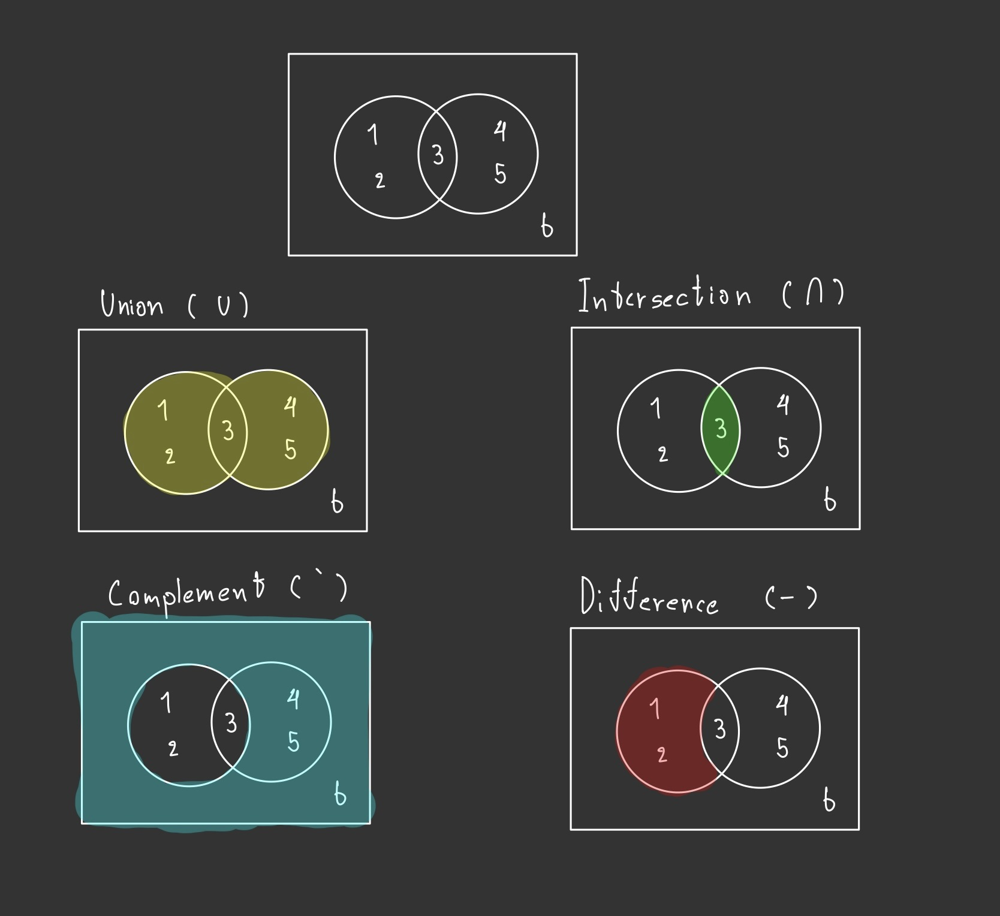
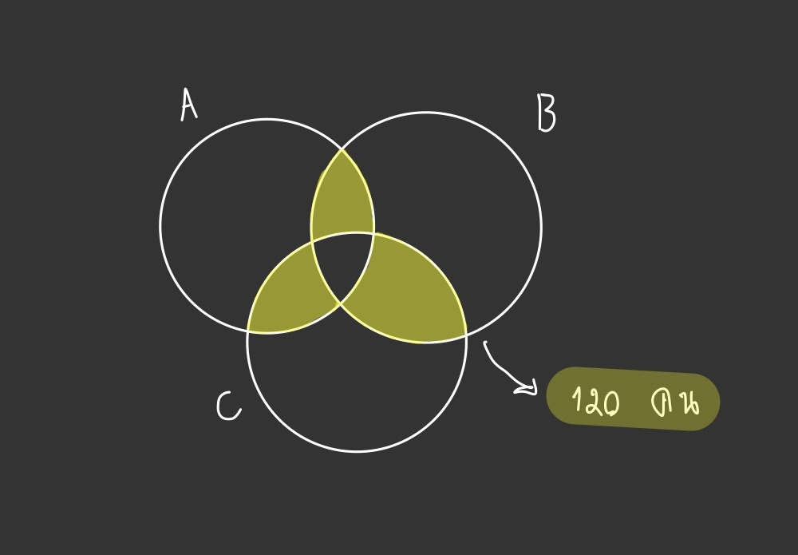
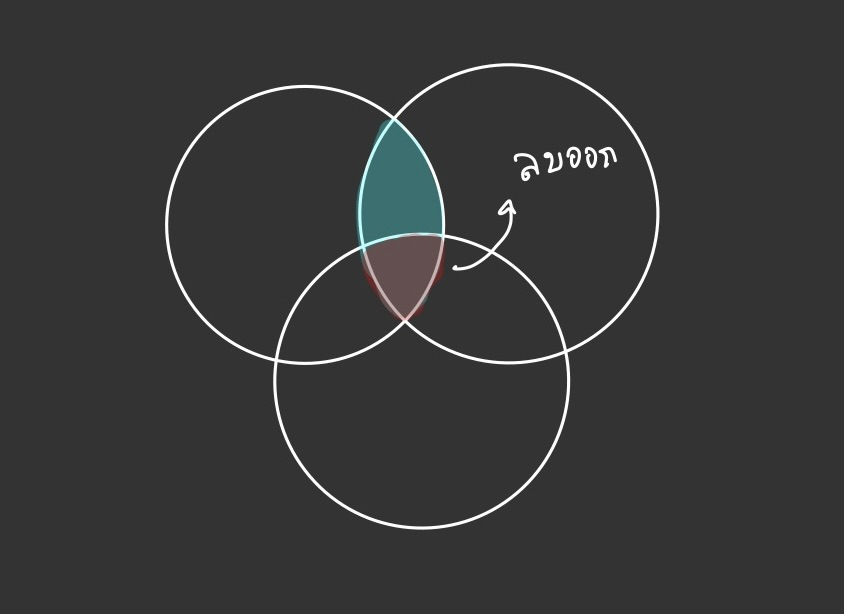
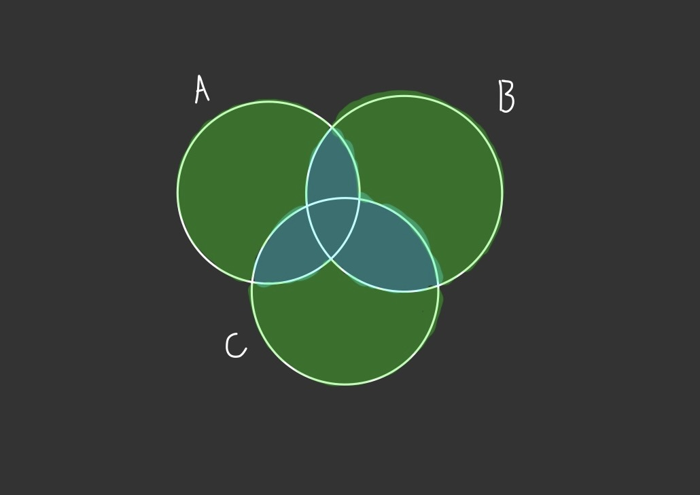

# เซต (Set)
### สิ่งที่ควรเรียนมาก่อน (Prerequisite)
- [ตรรกศาสตร์ (Logic)](Logic.md)  

ในเรื่องนี้จะมีเนื้อหาเกี่ยวกับสิ่งที่เรียกว่าเซต
<!--
# แผนผังแสดงความสัมพันธ์ของจำนวนชนิดต่างๆ

-->

# เซต คืออะไร
เซต คือ กลุ่มของสิ่งต่าง ๆ ที่สนใจ โดยเมื่อกล่าวถึงกลุ่มใดจะสามารถบอกได้แน่นอน 

ว่าสิ่งใดอยู่ในกลุ่ม สิ่งใดไม่อยู่ในกลุ่ม ตัวอย่างเช่น เซตของจังหวัดในประเทศไทย

มักใช้อักษรภาษาอังกฤษตัวใหญ่ในการกล่าวถึงเซต เช่น $A, B, C$

ส่วนสิ่งที่เป็นคุณภาพเราจะไม่ถือว่าเป็นเซต เช่น เซตของอาหารอร่อยในประเทศไทย

## สมาชิกในเซต

คือ สิ่งที่อยู่ในเซต โดยเราสามารถใช้เครื่องหมาย $\in$ เพื่อบอกการเป็นสมาชิกได้ เช่น

- $2$ เป็นสมาชิกในเซต $A$ เราสามารถเขียนเป็น $2 \in A$

เช่นเดียวกันเราก็มีเครื่องหมายไม่เป็นสมาชิกคือ $\notin$ เช่น

- $3$ เป็นไม่สมาชิกในเซต $A$ เราสามารถเขียนเป็น $3 \notin A$

## วิธีการเขียนเซต

### 1. แบบใช้ข้อความ

เราสามารถเขียนเซตในรูปข้อความ เช่น "เซตของนักเรียนระดับชั้น ม.4" หรือ "เซตของผลไม้" แต่จะต้องไม่มีสิ่งที่เป็นคุณภาพ เช่น "เซตของคนหล่อ"

### 2. แบบการแจกแจงสมาชิก

เราสามารถเขียนเซตด้วยการเขียนสมาชิกทั้งหมดในเซตและครอบด้วยเครื่องหมายปีกกา $\{\}$ เช่น

- $A = \lbrace 1, 2, 3, 4, 5\rbrace$
- $B = \lbrace 2, 4, 6, 8\rbrace$

เรายังสามารถเขียนเซตที่มีสมาชิกเยอะมากๆ ได้ด้วยการเติมเครื่องหมาย $\ldots$ ได้อีกด้วย เช่น

- $A = \lbrace1, 2, 3, 4, 5, \ldots\rbrace$
- $B = \lbrace1, 3, 5, 7, \ldots, 101\rbrace$

### 3. แบบกำหนดเงื่อนไข

เราสามารถเขียนเซตด้วยการกำหนดเงื่อนไขของสมาชิกในเซต 

นั่นคือเราจะกำหนดเงื่อนไขให้สิ่งของบางอย่างที่เข้าเงื่อนไขเท่านั้นสามารถเป็นสมาชิกในเซตได้ เช่น

- $A = \lbrace x\text{ | } x$ เป็นจำนวนเต็ม $\rbrace$

## ชนิดของเซต

### 1. เซตจำกัด

เซตที่มีจำนวนสมาชิกเป็นจำนวนจำกัดสามารถนับได้ เช่น $\lbrace 1, 2, 3 \rbrace$

### 2. เซตอนันต์

เซตที่มีจำนวนสมาชิกเป็นอนันต์ไม่สามารถนับได้ เช่น $\lbrace 1, 2, 4, 8, \ldots\rbrace$

## จำนวนสมาชิกในเซต

เราจะใช้สัญลักษณ์ $n(A)$ หรือ $|A|$ เพื่อนับจำนวนสมาชิกในเซต**จำกัด** $A$

เช่น $A = \lbrace 2, 4, 5, 6\rbrace, n(A) = 4$ 

ซึ่งหากมีสมาชิกซ้ำกันเราจะนับเพียงหนึ่งครั้ง

เช่น $A = \lbrace 2, 2, 2, 2\rbrace, n(A) = 1$ 

## เซตว่าง

เป็นเซตที่มีจำนวนสมาชิกเป็น $0$ เขียนแทนด้วย $\lbrace\rbrace$ หรือ $\varnothing$

## เอกภพสัมพัทธ์ (Relative Universe)

เป็นเซตที่เป็นขอบเขตเซตเซตอื่นๆ ที่จะพิจารณาโดยเซตอื่นๆ ห้ามมีสมาชิกที่อยู่นอกเหนือเอกภพสัมพัทธ์ 

ส่วนใหญ่จะเขียนเซตของเอกภพสัมพัทธ์ด้วย $\mathbb{U}$

# แผนภาพของเวนน์-ออยเลอร์ (Venn Diagram)

เป็นแผนภาพที่มักจะแสดงเซตเป็นวงกลม ซึ่งอยู่ในเอกภพสัมพัทธ์ที่มักจะเป็นสี่เหลี่ยม ทำให้เข้าใจเซตได้ง่ายขึ้น และค่อนข้างจำเป็นในการทำโจทย์

ตัวอย่างภาพของ Venn Diagram ซึ่งมีเอกภพสัมพัทธ์ คือ $\lbrace 1, 2, 3, ..., 9 \rbrace$ และประกอบด้วยเซตสองเซตคือ $\lbrace 1, 2, 3 \rbrace$ และ $\lbrace 3, 4, 5, 6 \rbrace$

# การดำเนินการของเซต

## 1. Union $(\cup)$

เป็นการดำเนินการที่จะเอาสมาชิกของเซตสองเซตมา "รวม" กัน ซึ่งการรวมในที่นี้จะถือว่าตัวที่ซ้ำกันจะนับแค่หนึ่งรอบ

เช่น $\lbrace 1, 2, 3 \rbrace \cup \lbrace 3, 4, 5 \rbrace = \lbrace 1, 2, 3, 4, 5 \rbrace$

## 2. Intersection $(\cap)$

เป็นการดำเนินการที่จะเอาสมาชิกที่อยู่ในเซต "ทั้งสองเซต" ออกมาเท่านั้น

เช่น $\lbrace 1, 2, 3 \rbrace \cap \lbrace 3, 4, 5 \rbrace = \lbrace 3 \rbrace$

## 3. Complement $(')$

เป็นการดำเนินการในเซตเดียวที่จะหมายถึงเซตที่มีสมาชิกทุกตัวใน เอกภพสัมพัทธ์ $(\mathbb{U})$ ที่ไม่อยู่ในเซตนั้น เช่น 

- $A = \lbrace 1, 2, 3 \rbrace$
- $\mathbb{U} = \lbrace 1, 2, 3, 4, 5 \rbrace$
- $A' = \lbrace 4, 5 \rbrace$

## 4. Difference $(-)$

เป็นการดำเนินการในเซตสองเซตสมมุติว่าคือ $A, B$ โดย $A - B$ จะเป็นเซตที่มีสมาชิกทุกตัวใน $A$ ที่ไม่อยู่ใน $B$ เช่น

- $A = \lbrace 1, 2, 3 \rbrace$
- $B = \lbrace 3, 4, 5 \rbrace$
- $A - B = \lbrace 1, 2 \rbrace$
- $B - A = \lbrace 4, 5 \rbrace$

# สับเซต, พาวเวอร์เซต

## สับเซต (Subset)

เราจะกล่าวว่า $A$ เป็นสับเซตของ $B$ ก็ต่อเมื่อ สมาชิกทุกตัวใน $A$ อยู่ใน $B$ ด้วย

ซึ่งสามารถใช้สัญลักษณ์ $(\subset)$ เขียนแทนเป็น $A \subset B$

ซึ่งโจทย์สามารถทำให้เราสับสนระหว่างการเป็นสมาชิกและสับเซตได้ง่าย ๆ เช่น

$\lbrace 1,2 \rbrace$ เป็นสมาชิกของ $\lbrace 1, 2, 3\rbrace$ หรือไม่

ซึ่งต้องตอบว่าไม่เนื่องจากเซตดังกล่างมีสมาชิกแค่สามตัวคือ $1, 2, 3$

แต่หากถามว่า $\lbrace 1,2 \rbrace$ เป็นสับเซตของ $\lbrace 1, 2, 3\rbrace$ หรือไม่

ต้องตอบว่าใช่

## สับเซตแท้ (Real Subset)

เราจะกล่าวว่า $A$ เป็นสับเซตของ $B$ ก็ต่อเมื่อ สมาชิกทุกตัวใน $A$ อยู่ใน $B$ ด้วย

และ $A \neq B$

ซึ่งสามารถใช้สัญลักษณ์ $(\subseteq)$ เขียนแทนเป็น $A \subseteq B$

## พาวเวอร์เซต (Power Set)

พาวเวอร์เซตของ $A$ สามารถเขียนแทนด้วย $P(A)$ คือเซตซึ่งประกอบไปด้วยสับเซตทั้งหมดของ $A$ เช่น

- $A = \lbrace 1, 2 \rbrace$
- $P(A) = \lbrace \varnothing , \lbrace 1 \rbrace , \lbrace 2 \rbrace, \lbrace 1, 2 \rbrace \rbrace$

เราสามารถสังเกตได้ว่า $n(P(A)) = 2^{n(A)}$

# สมบัติของเซต (ที่ควรจำ)

กำหนดให้ $A, B, C$ เป็นเซตใด ๆ

### สมบัติทั่วไป

- $A\cup \varnothing = A$
- $A\cap \mathbb{U} = A$
- $A\cap A = A \cup A = A$
- $(A')' = A$
- $A' = \mathbb{U} - A$
- $A - B = A\cap B'$
- $\varnothing \subset A$
- $\varnothing \in P(A)$

### สมบัตการแจกแจง

- $A\cap (B \cup C) = (A\cap B)\cup (A\cap C)$
- $A\cup (B \cap C) = (A\cup B)\cap (A\cup C)$

### Inclusion - Exclusion principle (สำคัญ)

- $n(A\cup B) = n(A) + n(B) - n(A\cap B)$
- $n(A\cup B \cup C) = n(A) + n(B) + n(C) - n(A\cap B) - n(A\cap C) - n(B\cap C) + n(A\cap B\cap C)$

### De Morgan's Law

- $(A\cap B)' = A'\cup B'$
- $(A\cup B)' = A'\cap B'$

# ตัวอย่างโจทย์ สอวน.

## สอวน. คอมปี 62 ข้อที่ 38

- ถ้า $n(A) = 20, n(B) = 30$ และ $n(A\cup B) = 40$ แล้ว $n(A\cap B)$ มีค่าเท่าไหร่

จากสมบัติ $n(A\cup B) = n(A) + n(B) - n(A\cap B)$

เราจะนำค่าจากโจทย์มาแทนจะได้ว่า

- $40 = 20 + 30 - n(A\cap B)$
- $40 = 50 - n(A\cap B)$
- $n(A\cap B) = 50 - 40$
- $n(A\cap B) = 10$

จึงต้องตอบ $10$ นั่นเอง

## สอวน. คอมปี 62 ข้อที่ 22

จากการสำรวจกีฬาที่ชื่นชอบ ของนักเรียน 300 คน โดยแต่ละคนชอบกีฬาอย่างน้อย 1 ชนิดพบว่า

- มีคนชอบกีฬาสองชนิดจำนวน 120 คน
- มีคนชอบกีฬาฟุตบอล รวมกับคนชอบกีฬาบาสเกตบอล รวมกับคนที่ชอบกีฬาว่ายน้ำ จำนวน 450 คน

จงหาคนที่ชอบกีฬาเพียงชนิดเดียว

หากเราพิจารณาจากสิ่งที่โจทย์ให้มาเป็นเซตสามเซต แทนกีฬาที่ชอบของนักเรียน และสังเกตว่าเนื่องจากนักเรียนทุกคนต้องชอบกีฬาอย่างน้อยหนึ่งชนิด นักเรียนทุกคนต้องอยู่ในเซตใดเซตหนึ่งอย่างแน่นอน

จากข้อมูลแรกคือ มีคนชอบกีฬาสองชนิดจำนวน 120 คน สามารถเขียนเป็น Venn Diagram ดังนี้

หากเราพิจารณาดี ๆ เราสามารถหาค่าในรูปของผลรวมของสมาชิกเซตได้ โดยพิจารณาส่วน ๆ หนึ่ง

จะมีค่าเท่ากับ $n(A\cap B) - n(A\cap B\cap C)$ ซึ่งนำมารวมกันทั้งหมดแล้วจะได้

$ n(A\cap B) - n(A\cap B\cap C) + n(B\cap C) - n(A\cap B\cap C) + n(B\cap C) - n(A\cap B\cap C) $

$ = n(A\cap B) + n(B\cap C) + n(B\cap C) - 3n(A\cap B\cap C) = 120$

จากนั้นเรามีอีกข้อมูลคือ มีคนชอบกีฬาฟุตบอล รวมกับคนชอบกีฬาบาสเกตบอล รวมกับคนที่ชอบกีฬาว่ายน้ำ จำนวน 450 คน

หมายถึง $n(A) + n(B) + n(C) = 450$

จากนั้นข้อมูลสุดท้ายคือมีนักเรียนทั้งหมด $300$ คน เขียนเป็นจำนวนสมาชิกเซตคือคือ $n(A\cup B\cup C)$

จะได้ว่า $n(A) + n(B) + n(C) - n(A\cap B) - n(A\cap C) - n(B\cap C) + n(A\cap B\cap C) = 300$ จากสมบัติของเซต

จากนั้นเราจะนำค่าที่เราหามาได้มาแทนคือ 

- $n(A) + n(B) + n(C) = 450$
- $n(A\cap B) + n(B\cap C) + n(B\cap C) - 3n(A\cap B\cap C) = 120$
- จัดรูปเป็น $n(A\cap B) + n(B\cap C) + n(B\cap C) = 120 + 3n(A\cap B\cap C)$

จะได้ว่า

- $300 = 450 - (120 + 3n(A\cap B\cap C)) + n(A\cap B\cap C)$
- $300 = 450 - 120 - 3n(A\cap B\cap C) + n(A\cap B\cap C)$
- $300 = 330 - 2n(A\cap B\cap C)$
- $2n(A\cap B\cap C) = 330 - 300$
- $n(A\cap B\cap C) = \frac{30}{2}$
- $n(A\cap B\cap C) = 15$

จากนั้นเราจะหาคนที่ชอบกีฬาประเภทเดียวโดยใช้การ Complement

ชอบกีฬาหนึ่งประเภท = ทั้งหมด - ชอบสองประเภท - ชอบสามประเภท  
= $n(A\cup B\cup C) - 120 - n(A\cap B\cap C)$  
= $300 - 120 - 15$  
= $165$

จึงต้องตอบ $165$ คนนั่งเอง

